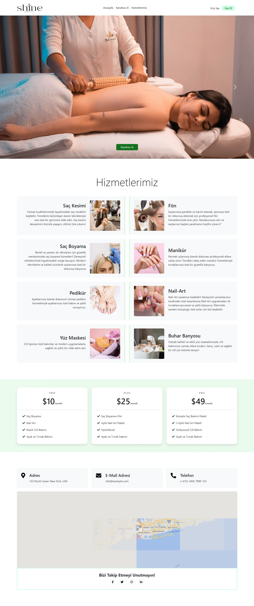
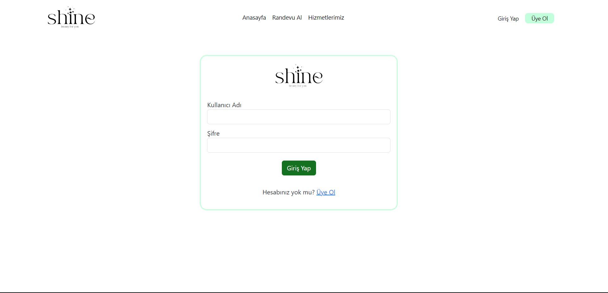
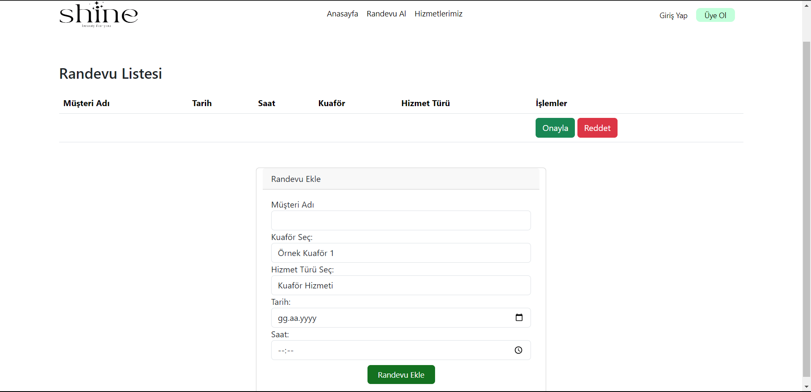
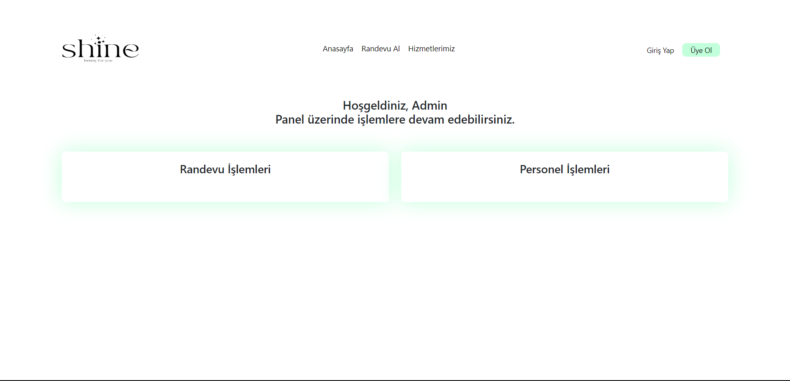
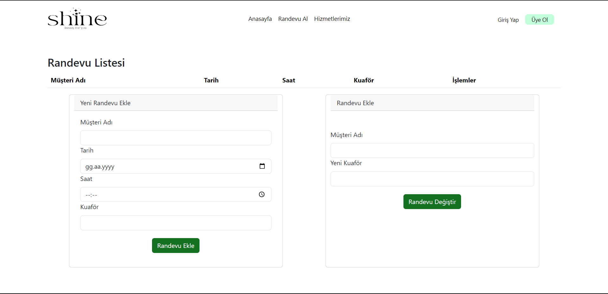
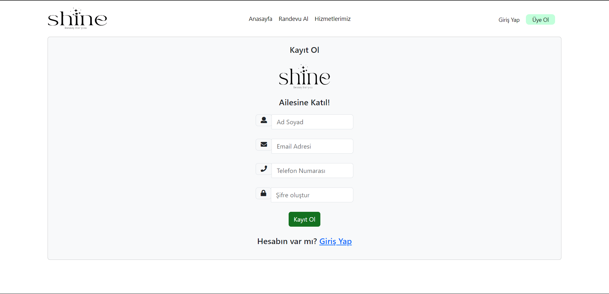
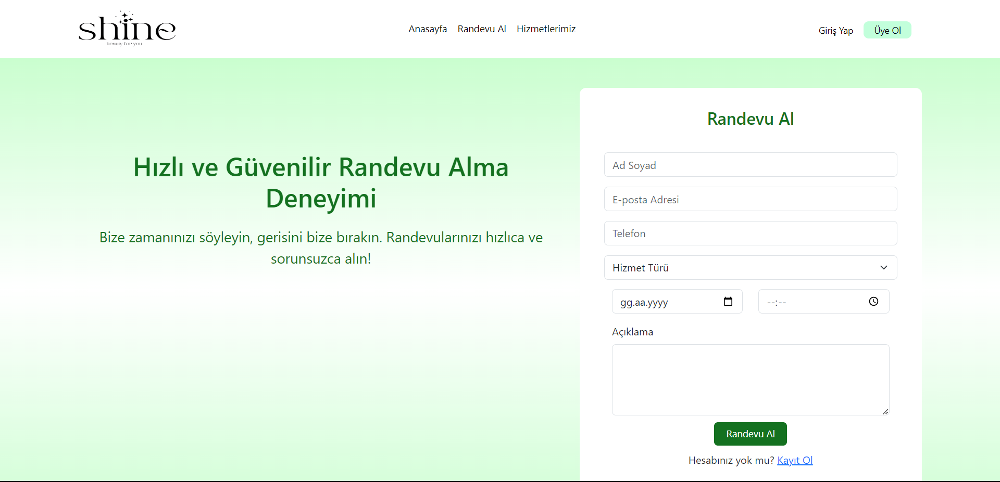

# Kuafor Randevu Sistemi

Bu proje, bir kuaförün randevu almak ve takip etmek için kullanılan basit bir sistemdir. Müşteriler, randevu alabilir, randevularını düzenleyebilir ve iptal edebilirler. Kuaför çalışanları ise randevuları görüntüleyebilir ve yönetebilirler.

## Teknolojiler

- **Backend:** Java, Spring Boot, Spring Data JPA
- **Veritabanı:** MySQL
- **IDE:** IntelliJ IDEA
- **Frontend:** HTML, CSS, jQuery
- **API Test:** Postman

## Ekran Görüntüleri

